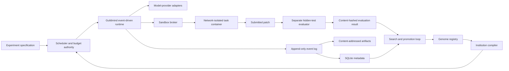

# Guildmind: Staged Build Plan

**Status:** Proposed implementation and research plan<br>
**Date:** 2026-07-31<br>
**Scope:** From greenfield repository to validated institutional search, then persistent institutions, hybrid evolution–reinforcement learning, judge societies, and transfer<br>
**Planning assumption:** Two hands-on contributors—one focused on research/evaluation and one on systems—using hosted models and Linux containers

## 1. The outcome we are building toward

The first meaningful Guildmind milestone is not a multi-agent demo. It is an evidence package supporting or rejecting this claim:

> A frozen, machine-readable institution discovered on development tasks resolves more unseen software-engineering tasks than strong solo and multi-agent baselines, under the same aggregate inference and tool budget.

That package must contain the institution, every baseline, the experiment contract, task fingerprints, complete run traces, resource accounting, a sealed evaluation, statistical analysis, ablations, and all failed runs. It should be possible for another researcher to rerun the comparison without relying on our interpretation.

Only after this result is credible should Guildmind invest in persistent reputation, apprenticeship, learned institutional controllers, judge societies, or institutional transfer.

## 2. The build sequence

The order is deliberately conservative:

```text
Experiment contract
        ↓
Measurement substrate
        ↓
Strong baselines
        ↓
Executable institution language
        ↓
Search and selection
        ↓
Sealed confirmation
        ↓
Persistent institutions
        ↓
Hybrid evolution + reinforcement learning
        ↓
Judge societies
        ↓
Cross-domain transfer
```

Each stage earns the complexity of the next one. A stage may end in a negative result; that is a valid research outcome, not permission to skip the gate.

## 3. Stages at a glance

Durations are planning ranges for a small two-person team, not commitments. Stages 0–6 form the first complete research program.

| Stage | Result | Indicative duration | Gate to advance |
|---|---|---:|---|
| 0. Experiment contract | Frozen pilot protocol, eligibility rules, maximum budgets, decision rules, and threat model | 1–2 weeks | No material ambiguity about how pilot evidence will determine the final protocol |
| 1. Measurement substrate | Reproducible single-task runner and isolated evaluator | 2–3 weeks | Deterministic fixtures replay exactly; failures and spend are fully recorded |
| 2. Baselines | Solo, fixed-team, reflection, and best-of-N reference results | 2–3 weeks | Stable infrastructure and defensible equal-budget comparisons |
| 3. Institution language | Validated genome schema and interpreter | 2–4 weeks | Several organizations run from data alone and always respect invariants |
| 4. Search machinery | Noise-aware search, lineage, promotion, and archives | 2–3 weeks | Search works on a synthetic landscape and cannot access sealed data |
| 5. Exploratory search | Frozen champion selected on development data | 4–6 weeks | Champion clears the numerical promotion rule with no integrity violation |
| 6. Sealed confirmation | First positive, equivocal, or negative research result | 2–3 weeks | Predeclared analysis complete, with no post-hoc candidate changes |
| 7. Persistent institutions | Reputation, certification, apprenticeship, and durable memory | 6–8 weeks | Stateful rules beat matched stateless controls on future tasks |
| 8. Hybrid evolution + RL | Evolved institutional structures with RL-trained, bounded executable controllers | 8–12 weeks | Hybrid beats evolution-only and RL-only controls at matched total training and execution budget |
| 9. Judge societies | Human-calibrated, independently evolved evaluation systems | 8–12 weeks | Judges predict held-out human preferences robustly and add signal beyond tests |
| 10. Transfer | Frozen institutions tested on new distributions and domains | 6–10 weeks | Benefit survives without target-domain optimization |

The likely engineering path to the first sealed result is roughly 16–23 calendar weeks with two contributors, assuming benchmark infrastructure and model APIs behave and corpus construction runs in parallel. It excludes any unavoidable wait for enough tasks created after the chosen model snapshot; freshness can dominate the calendar. One contributor can execute the same plan, but the evaluation, corpus, and infrastructure work will serialize.

## 4. Program hypotheses

Keep the claims separate so one result cannot masquerade as another.

- **H1 — Institutional effect:** At a fixed resource budget, a frozen searched institution beats each required frozen comparator: solo, solo-reflection, equal-budget best-of-N, and the fixed expert-designed team.
- **H2 — Search effect:** A declared organizational search method finds strong institutions more efficiently than random search and manual enumeration under the same search-evaluation budget.
- **H3 — Persistence effect:** Durable rules and accumulated reputation improve future performance beyond what can be explained by extra context or retrieval.
- **H4 — Hybrid adaptation effect:** At a matched total training and execution budget, evolving institutional structures while reinforcement-learning a bounded institutional controller improves held-out adaptation speed and frozen-policy performance beyond evolution-only and RL-only controls.
- **H5 — Judge effect:** A calibrated judge society predicts held-out human preferences better than a single judge while remaining anchored to objective evidence.
- **H6 — Transfer effect:** A frozen institution retains benefit on a new task distribution, repository family, language, or domain.

Stages 0–6 test H1 and provide exploratory evidence about H2. Stages 7, 8, 9, and 10 test H3, H4, H5, and H6 respectively. Do not describe the project as continually self-correcting until H4 survives, or as recursive self-improvement until at least H1, H3, and H6 have survived.

## 5. Recommended technical shape

### 5.1 Build the research core; borrow the commodity pieces

Guildmind should build:

- the genome schema and validator;
- the institution interpreter;
- the authoritative budget ledger;
- the event and artifact model;
- the candidate lineage and archive;
- the search/promotion logic; and
- the experiment and analysis contracts.

Guildmind should borrow or adapt:

- model-provider clients;
- Docker-based task images and benchmark evaluators;
- sandbox execution adapters;
- standard tracing/export formats; and
- statistical and dataframe libraries.

The core research question concerns orchestration. A high-level multi-agent framework that silently manages prompts, histories, routing, or retries would become an uncontrolled part of the treatment. Use such frameworks as comparison adapters, not as the source of truth for the core runtime.

### 5.2 PettingZoo: useful boundary, wrong core

PettingZoo standardizes multi-agent reinforcement-learning **environments**. Its AEC API advances one eligible agent at a time through observation, reward, termination/truncation, and action; its Parallel API advances simultaneous actions at the end of a cycle. Guildmind's core problem is different: interpret an institution whose roles make variable-duration model/tool calls, exchange scoped messages, edit a shared artifact, consume a shared budget, and submit to a separate evaluator.

Do not make PettingZoo the Guildmind scheduler or encode the organizational genome as a custom PettingZoo environment. That would let AEC/Parallel turn semantics become an accidental restriction on the institution and would conflate three identities: environment player, organizational role, and model invocation.

PettingZoo is valuable in three bounded ways:

1. **Stage 4 testbed:** use versioned cooperative/competitive environments with scripted or cheap policies to test event ordering, termination versus budget truncation, action legality, search archives, and noisy rewards before expensive coding campaigns.
2. **Stage 8 RL testbed:** train bounded institutional controllers against explicit observation, action, transition, reward, and truncation semantics before paying for model-backed software episodes.
3. **Stage 10 transfer domain:** test whether a frozen coordination/review/memory/controller rule helps in a structurally different multi-agent environment with machine-gradeable reward.

Implement this only as an optional `PettingZooTaskAdapter` behind an `Environment` protocol after Genome v0 works. The adapter translates reset/observation/action/reward/termination/truncation into Guildmind events. PettingZoo owns which environment player is eligible and when a game cycle advances; Guildmind owns the internal role work used to produce that player's action, along with budgets, trace ordering, and institution policy. The mapping from PettingZoo player IDs to Guildmind roles/societies must be explicit in the experiment spec. Pin the exact environment version, wrappers, spaces, seed, and dependency lock.

A small Stage 4 spike—one AEC environment and one Parallel environment, using deterministic fake policies—is sufficient to decide whether the adapter earns maintenance. Do not wrap repository-level coding tasks in PettingZoo; their sandbox, patch, and hidden-test lifecycle fits the native `TaskSpec`/`Evaluator` boundary better.

### 5.3 Provisional stack

Record final choices as architecture decision records during Stage 0.

- Python 3.12 with a locked `pyproject.toml` environment.
- Pydantic models plus exported JSON Schema for public artifacts.
- YAML for human-authored experiment and genome files; canonical JSON for hashing.
- `asyncio` plus bounded local worker processes for initial concurrency.
- SQLite for control-plane state and a filesystem content-addressed store for immutable artifacts. One control-plane process owns all database writes and logical event ordering; sandbox workers return messages and never write SQLite or trace files directly.
- Parquet exports for analysis.
- Docker for local isolation, behind a `Sandbox` interface; evaluate SWE-ReX when remote scale becomes necessary.
- Direct provider adapters behind a small `ModelClient` protocol. Spike Pydantic AI Core as an optional first adapter, but adopt it only if raw requests, responses, usage, and Guildmind-owned scheduling semantics remain intact.
- `pytest`, property-based schema tests, static typing, and linting in CI.
- Transactional event and budget tables as the authoritative trace, with generated JSONL and optional OpenTelemetry exports.

Do not begin with Kubernetes, a distributed database, a web dashboard, or a general workflow engine. Add durable queues or remote workers after local evaluation throughput is measured and shown to be the bottleneck.

### 5.4 Target architecture and trust boundary



The worker container must never receive model API credentials, the Docker socket, hidden tests, evaluator code, future repository history, or the search database. Model calls are brokered outside the container. When a worker terminates, its patch is copied into a fresh evaluation environment. Objective evaluation results flow back to the research control plane, not into the same task attempt.

Every benchmark task is compiled into two physical bundles. The worker bundle contains only a randomized alias, problem statement, clean repository snapshot, and permitted public tests. The grader bundle contains hidden tests, gold/reference data, expected transitions, provenance, and QA metadata. Never pass an upstream benchmark row directly to the worker: common benchmark schemas include solution-bearing fields even when the agent-facing prompt does not.

Run workers as non-root with a read-only base filesystem, a genuinely quota-bounded writable workspace, no network, dropped Linux capabilities, default-or-stricter seccomp, and CPU, memory, PID, disk, output, and wall-time limits. `--network none` means task images must contain all permitted dependencies and test tooling before execution. `guildmind doctor` verifies cgroup controllers and every required limit, then fails closed if the host cannot enforce them.

Hidden tests live outside the patched tree and run through a host-owned entrypoint. Patch intake rejects traversal, symlinks, submodule changes, unexpected paths, and oversized/binary payloads before applying the diff to a fresh checkout. The evaluator also has no network and returns only the predeclared result evidence. Authoritative campaigns run on disposable controlled x86_64 Linux workers without unrelated high-value data; macOS Docker is useful for development but is not the reference environment.

### 5.5 Core domain objects

Every object has a schema version and stable content hash.

| Object | Purpose | Required identity material |
|---|---|---|
| `TaskSpec` | Immutable task, environment, visible tests, and split membership | Task source, repository commit, image digest, task-content hash |
| `Genome` | Genome v0 society/policy specification; in Stage 8, the invariant and legal-action envelope `g` | Parent IDs, prompt hashes, roles, graph, capabilities, hard governance constraints, memory boundaries, budgets |
| `ExperimentSpec` | Hypothesis and comparison contract | Candidate set, task split, repeats, caps, metrics, stopping and retry rules |
| `RunManifest` | One attempted task execution | Task, candidate, model snapshot, parameters, seed, environment, code revision; Stage 8 additionally binds `g`, `p`, `θ`, `s`, compatibility-signature and `RewardSpec` hashes, plus both lineage heads |
| `Event` | Append-only state transition | Run ID, logical sequence, causal parent IDs, event type/version, monotonic and wall time, payload and previous-event hashes |
| `Artifact` | Prompt, message, tool output, patch, log, or report | Media type, size, content hash, storage reference |
| `BudgetLedger` | Authoritative debits and remaining resources | Requested/returned model, provider request ID, raw usage, token classes, calls/retries, tool time, wall time, price-table hash, monetary estimate |
| `Evaluation` | Objective or calibrated subjective result | Evaluator version, task and patch hashes, result, evidence, content hash |
| `Candidate` | Search state for one institutional phenotype | Genome ID, parents, mutation, evaluations, archive status; Stage 8 additionally binds the `(g, p, θ, s)` identities, `RewardSpec`, separate structure/program and controller-checkpoint parent edges, and learning-hyperparameter mutation |

The Stage 8 fields are future schema requirements, not claims about the current implementation. In that stage, changing any phenotype component, reward contract, or lineage head creates a new `Candidate` identity, and every `RunManifest` names the exact resulting identities used for execution. A mutable label such as “candidate 12” or “latest checkpoint” is never evidence identity.

Every run emits a terminal manifest. Produced artifacts use the following names; artifacts that cannot exist for an early failure are represented explicitly as `not_produced` or `not_run` in the manifest rather than silently omitted:

```text
run.json
events.jsonl
budget.json
submitted.patch
evaluation.json
environment.json
artifacts.manifest.json
```

Guildmind promises three levels of reproducibility and labels them correctly:

- **Structural replay:** recorded model/tool responses reconstruct scheduler and institutional decisions exactly.
- **Operational rerun:** pinned code, images, genomes, prompts, and model settings recreate the procedure, while hosted model output may still vary.
- **Statistical replication:** repeated tasks and attempts quantify that irreducible variation.

Provider-managed conversation state is disabled initially. The full explicit message sequence and every raw usage object remain local and inspectable. OpenTelemetry may mirror the record, but sampling or exporter failure cannot erase the canonical event history.

Artifact blobs are written to a temporary path, flushed, and atomically renamed to their content hash before the single control-plane writer commits corresponding event and budget rows in one SQLite transaction. `events.jsonl` and analysis tables are reproducible exports, not competing sources of truth.

## 6. The organizational genome

### 6.1 Genome v0 boundaries

The first genome must be a small declarative language, not arbitrary Python. Arbitrary code makes mutation unsafe, comparison opaque, and replay dependent on hidden behavior.

Genome v0 should encode only:

- roles and their prompt references;
- tools visible to each role;
- per-role and shared budgets;
- allowed message edges and message visibility;
- scheduling and handoff conditions;
- review rounds;
- proposal, acceptance, veto, escalation, and termination rules; and
- bounded shared-memory scopes.

Illustrative shape:

```yaml
schema_version: guildmind.genome/v0
roles:
  - id: implementer
    prompt_ref: prompts/implementer-v1
    tools: [shell]
    budget_share: 0.60
  - id: reviewer
    prompt_ref: prompts/reviewer-v1
    tools: [shell_readonly]
    budget_share: 0.25
workflow:
  entrypoint: implementer
  max_rounds: 3
  edges:
    - from: implementer
      to: reviewer
      trigger: patch_proposed
policies:
  acceptance:
    requires: [objective_public_tests, reviewer_approval]
  dispute:
    on_reject: return_to_implementer
  termination:
    on_budget_exhausted: submit_current_patch
memory:
  shared_board:
    max_bytes: 16000
budgets:
  reserve_share: 0.15
```

The compiler validates the genome, derives a finite state machine, checks basic structural invariants, and refuses ambiguous or obviously invalid graphs. General termination comes from mandatory finite limits on activations, rounds, model/tool calls, messages, tokens, and wall time—not from pretending arbitrary policies can be proved terminating statically.

### 6.2 Mutation classes

Start with typed single changes:

- add, remove, or duplicate a role;
- add or remove a communication edge;
- adjust one budget allocation while preserving the total;
- add or remove a review round;
- change message visibility;
- change a routing, veto, escalation, or termination rule;
- enable or disable a bounded memory scope; and
- change a prompt reference in a separate prompt-search treatment.

Record structural and prompt mutations separately. This lets the analysis say whether a gain came from institutional organization, prompt optimization, or their interaction.

Crossover, free-form code mutation, model selection, and self-modifying search logic are out of scope until single mutations are interpretable and stable.

### 6.3 Future learned-controller and executable-policy layer

Stage 8 adds a second, explicitly separate inheritance channel without changing Genome v0 or the first experiment. Before the Stage 8 campaign, a versioned migration factors the relevant Genome v0 behavior into a constraint genome plus a policy program and must reproduce the v0 trace on conformance fixtures:

- the **organizational constraint genome** `g` defines the invariant envelope: role slots, capabilities, legal communication and memory access, hard budget and lifecycle caps, governance/safety constraints, and the action set `A_g` available in each state. It does not choose among simultaneously legal actions;
- a restricted, versioned **policy program** `p` chooses within `A_g` as a typed decision table, finite-state policy, behavior tree, or typed expression graph—never arbitrary Python or shell code;
- a trainable **controller checkpoint** `θ` parameterizes state-dependent choices inside that legal program; and
- durable institutional state `s` contains provenance-backed reputation, certification, and memory from Stage 7.

The instantiated phenotype is therefore `(g, p, θ, s)`, with controller notation `π_{p,θ}(a_t | o_t, g, s_t)` and the runtime enforcing `a_t ∈ A_g(o_t, s_t)`. Evolution may mutate `g`, the typed structure of `p`, and declared learning hyperparameters. Reinforcement learning updates `θ` from sequential experience. Worker foundation-model weights remain fixed in the first hybrid experiment, and task-specific solution code remains an output artifact rather than inherited program state. Any later role-adapter or foundation-model RL is a separately labeled treatment with its own baselines and budget.

The evolutionary population is a population of complete candidate institutions, not a bag of independently breeding worker models. Each candidate institution instantiates its own role population for an episode. Selection compares whole institutional phenotypes; the executable artifact being evolved is their bounded coordination policy `p`, while RL corrects the compatible controller parameters `θ` within a candidate's lifetime.

Every compiled policy exposes a compatibility signature covering its observation schema, legal action IDs, role slots, recurrent-state shape, and parameter layout. A child may inherit its parent's controller checkpoint only when the signatures are compatible. An incompatible structural mutation must either reinitialize the controller or use a predeclared, separately measured migration/distillation rule; it may never silently reinterpret weights.

This boundary permits both program evolution and learning while preserving causal attribution: discrete institutional structure is evolved, sequential behavior is corrected by RL, and arbitrary executable self-modification remains out of scope.

## 7. Evaluation design

### 7.1 Benchmark ladder

Use different data for engineering, search, confirmation, and transfer.

| Tier | Purpose | Recommended source | Evidentiary status |
|---|---|---|---|
| 0. Fixtures | Test the harness and evaluator | 20–50 deterministic faults across 3–5 tiny repositories | No capability claim |
| 1. Search corpus | Cheap repeated organizational evaluation | 200–300 newly generated and verified Python tasks across roughly 12–20 repositories, using SWE-smith-style tooling rather than its public corpus | Exploratory only |
| 2. Compatibility | Compare our harness with known systems | A fixed, explicitly hashed 10–20-task slice of official SWE-bench Verified | Legacy public reference; not the primary proof |
| 3. Confirmation lockbox | Test the frozen champion in one sealed campaign | 120–200 fresh real tasks created after the pinned model snapshot, from unseen repositories and held privately until freeze | Primary evidence |
| 4. Transfer | Test distributional generalization | Held-out repositories/languages, multimodal tasks, or a different verifiable domain | Transfer evidence |

Public SWE-bench remains useful because it is containerized, has a human-verified 500-task subset, and has extensive comparable traces. It is not a suitable headline result for frontier systems: a [2026 OpenAI audit](https://openai.com/index/why-we-no-longer-evaluate-swe-bench-verified/) reported both substantial residual task flaws and evidence of solution exposure across tested frontier models. Treat SWE-bench Verified as a compatibility appendix, not confirmation.

Use SWE-smith as task-generation tooling, not as a supposedly unseen public dataset. Generate a private repo-disjoint search corpus, verify the base failure and gold success repeatedly, remove flaky and underspecified tasks, and complete task QA before any Guildmind candidate outputs exist. A recommended internal partition is 120–160 adaptive search tasks, 40–60 one-shot development-selection tasks from unseen repositories, and 50–80 sealed synthetic transfer tasks from a third repository group.

For confirmation, mine or acquire recent real-world tasks using SWE-bench Live or SWE-rebench-style tooling. Both issue and solution must postdate the immutable model snapshot's release; otherwise choose an older snapshot, wait for new tasks, or downgrade the result from confirmatory. Require unseen repositories, deterministic Linux containers, and independent quality review. Spread 120–200 tasks across roughly 10–15 repositories and cap per-repository concentration. After the institution is frozen, reserve a future monthly/live window for one sealed no-tuning campaign.

Partition by repository and time, not merely by randomly shuffling issue IDs. Near-duplicate tasks or multiple faults in the same code region must remain in one partition. Treat repository/task—not repeated stochastic attempts—as the generalization unit.

Recommended logical splits:

- `fixture`: visible to everyone and rerun constantly;
- `search_train`: all racing, promotion, mutation, and search diagnostics occur here;
- `development_selection`: each search arm nominates a fixed number of finalists, evaluated here once to select the champion; this is selection data and supplies no confirmatory inference;
- `confirmation_lockbox`: never run until the champion and analysis are frozen; and
- `transfer`: a different source or distribution, opened after confirmation.

“One sealed campaign” does not mean one stochastic attempt. The experiment contract declares three to five paired attempts per method when pilot variance requires them, for both confirmation and forward transfer.

### 7.2 Corpus-construction workstream

Stage 0 freezes task eligibility, generation, QA, exclusion, fingerprinting, and escrow rules—not hundreds of future task IDs. Corpus construction proceeds in parallel with runtime work:

- Before Stage 2, complete the fixtures and compatibility slice.
- Before Stage 5, complete and freeze the private search and one-shot development-selection corpus.
- Before Stage 6, complete independent QA and escrow of the real confirmation corpus.
- Before Stage 10, preregister the source/time rule for the not-yet-created forward-transfer window.

Each generated or mined task must pass the following before inclusion:

- base repository fails the intended hidden test three consecutive times;
- gold patch passes hidden and regression suites three consecutive times;
- prompt and tests receive alignment review blinded to all Guildmind outputs;
- solution-bearing IDs, URLs, metadata, remotes, and future history are removed;
- worker/grader bundles and image digests are fingerprinted; and
- all exclusions are finalized before the lockbox campaign begins.

For the simplest future-history invariant, export the permitted source tree without `.git` and initialize a fresh repository. If history is required, reconstruct only the pre-cutoff objects. Maintain a security fixture that plants a future solution in refs, packed refs, tags, reflogs, and unreachable objects and proves the worker cannot recover any copy.

### 7.3 Fair resource accounting

One task attempt receives an aggregate budget shared by all workers in a society. The authoritative ledger records:

- uncached, cached, and output tokens;
- reasoning tokens where the provider exposes them;
- model calls and retries;
- aggregate tool CPU time;
- container wall time;
- elapsed end-to-end time;
- message count and stored-memory bytes; and
- provider-reported billable units, a frozen price-table estimate, and separately reconciled infrastructure/invoice totals.

Parallel execution may reduce wall time, but it does not reduce aggregate inference cost. Before dispatching each concurrent request, the ledger reserves a conservative maximum debit; it reconciles that reservation when provider usage arrives. In-flight hosted calls may not be reliably interruptible. Cancellation is best-effort, missing final usage receives a conservative debit, and no new calls start after exhaustion. A society that exhausts its cap must submit its current patch or fail according to the frozen policy.

CPU, memory, PID, disk, and output caps apply to the whole organization/task attempt, not independently to each container in a way that lets larger societies multiply their allowance.

Disable hidden automatic retries in provider/SDK clients. Guildmind records and budgets every declared retry. If a process dies after a provider accepted a request but before the response is committed, mark the call `ambiguous`; the frozen policy either abandons that task attempt or performs a counted retry with possible duplicate spend. Selective free reruns are forbidden.

All worker comparisons use the same frozen model snapshot, sampling settings, tool surface, initial task context, and aggregate cap. Separate experiments may study heterogeneous models later.

### 7.4 Required baselines

Run and tune these on development data before organizational search:

1. **Solo:** one agent with the entire cap.
2. **Solo plus reflection:** one agent with an explicit review/revision loop.
3. **Best-of-N:** independent attempts plus a selector, with attempts and selection sharing the same total cap.
4. **Fixed expert team:** a hand-authored planner → implementer → reviewer protocol.
5. **Random genomes:** valid organizations sampled without performance-guided parent selection.
6. **Search ablations:** the chosen search loop without archive/diversity, without LLM-guided mutation, and without inheritance where applicable.

Use mini-SWE-agent or another minimal published scaffold as an external compatibility baseline on the same model/task subset. Do not claim that a team effect exists merely because it spends more inference or includes another sampling attempt.

### 7.5 Metrics and statistics

The confirmatory estimand is the expected success probability of **one organization attempt under aggregate cap B**, averaged first equally over repositories in the declared target population, then equally over sampled tasks within each repository, and finally over the system's execution randomness. Repeated attempts estimate the last component; they are not additional independent tasks.

The primary endpoint is paired pass-at-budget difference. Stage 2 preselects one primary comparator using development data and freezes it before confirmation; lockbox outcomes never choose the comparator. H1 nevertheless requires the champion to clear the declared simultaneous lower-confidence rule against every required comparator—solo, reflection, best-of-N, and fixed expert team—so the headline cannot ignore a baseline that happened to perform better on new data.

Secondary endpoints:

- resolved tasks per million tokens;
- frozen-price-table provider cost estimate per resolved task;
- median and tail wall time;
- regression rate and invalid-patch rate;
- variance across repeated attempts;
- coordination overhead as a share of tokens and time;
- improvement retained on repository-, time-, and domain-held data; and
- search cost required to discover the candidate.

Avoid making a weighted blend of quality, cost, and speed the sole score. Treat the hard budget as a feasibility constraint, maximize task success within it, and retain a Pareto frontier over quality, cost, latency, and reliability.

During Stage 0, use pilot variance to set:

- a minimum effect size worth pursuing;
- task and repeat counts;
- the paired statistical test;
- confidence-interval method;
- correction for any secondary hypothesis family; and
- exact handling of infrastructure failures and missing outcomes.

Treat 120–200 confirmation tasks as a cost placeholder, not a power guarantee. The Stage 2 protocol revision uses simulation under the intended hierarchical model, pilot candidate–baseline discordance, within-task execution noise, repository heterogeneity, and the minimum repository count to determine exact tasks and attempts.

For one paired binary outcome per task, report the paired contingency table and an appropriate paired test in addition to effect size and interval. With repeated attempts, use the preregistered hierarchical or repository-clustered analysis rather than reducing selectively or pretending each run is an independent task. Randomize execution order within repository/task blocks and pair systems on the declared task and attempt schedule. Report repository-level effects; do not let one large repository dominate the headline estimate.

### 7.6 Evaluation-integrity threat model

Stage 0 must address at least:

- hidden tests or gold patches appearing in the worker filesystem;
- future commits remaining in `.git` history;
- network access to source repositories, package sources, or known patches;
- task IDs eliciting memorized public answers;
- task-specific strings accumulating in genomes or shared memory;
- evaluator code being altered by a submitted patch;
- selective retries or discarded failures inflating results;
- model aliases changing underneath a frozen experiment;
- framework updates changing hidden prompts or tool behavior;
- repeated lockbox inspection becoming development feedback; and
- workers and judges sharing models, traces, prompts, or selection state.

The lockbox is a process, not just a directory name: access must be logged, limited, and followed by either publication of the result or retirement of that lockbox.

## 8. Search strategy

### 8.1 Map the space before evolving it

Before launching evolutionary search, run a small designed screen over a few interpretable factors—review/no review, centralized/decentralized routing, private/shared messages, one/two implementers, and budget allocation. This reveals broken dimensions, estimates noise, and identifies obviously wasteful regions.

This screen is not the final search. It is instrumentation for choosing a viable search space.

### 8.2 First search algorithm

Use a simple, inspectable combination:

1. Seed an archive with the tuned baselines and a diverse set of valid genomes.
2. Select parents from several small quality-diversity islands/Pareto archives, not only the current scalar winner; allow occasional migration to limit premature convergence.
3. Apply one typed mutation.
4. Evaluate cheaply on a small task panel.
5. Promote promising candidates through successive-halving rungs with more tasks and repeats.
6. Store every candidate, failure, lineage edge, and evaluation.
7. Select a champion by a rule frozen before the final development evaluation.

Choose only two or three coarse diversity descriptors at first—for example topology family, agent count, and review intensity. More dimensions make a small archive sparse. Other diagnostics such as coordination depth, communication density, and measured overhead can remain report columns until the campaign is large enough to justify another archive axis.

Begin with deterministic/random typed mutation. Add an LLM mutation proposer only as a separately measured search arm. The proposer may see parent genomes, allowed metrics, and search-train failure summaries; it may never see lockbox tasks, hidden tests, or gold patches.

Rank feasible candidates by conservative paired evidence, such as a lower confidence bound on gain over their parent/incumbent, then use cost and latency among practically equivalent candidates. This bound is an adaptive search heuristic, not confirmatory confidence evidence.

Cheap-rung promotion is valid only if a real-development pilot across varied genomes reaches the preregistered fidelity criteria. Recommended defaults are Spearman rank correlation of at least 0.60 with the full panel, at least 80% recall of full-panel top-quartile candidates, and at most 10% false elimination of candidates whose full-panel gain exceeds the minimum relevant effect. If these fail, enlarge the rung or abandon successive halving.

### 8.3 Separate institution quality from search quality

Two independent comparisons are required:

- Compare the final institution with solo, solo-reflection, best-of-N, and fixed-team baselines to test H1.
- Compare evolutionary/archive search with random search and manual enumeration at equal candidate-evaluation budgets to test H2.

An excellent candidate discovered inefficiently can support H1 without supporting H2. Conversely, a search method that finds the least-bad candidate quickly does not establish that institutions are useful.

H2 search arms start from the same initial candidate/archive set and share the genome grammar, mutation inventory, task and attempt blocks, evaluator, racing machinery, and total budget; they differ only in the search component under test. Count factor-screen evaluations, proposer model calls, invalid proposals, retries, and any costed manual enumeration in the search budget.

If H2 is confirmatory, repeat the complete search procedure for the predeclared number of campaign seeds and compare best-at-budget and area-under-best-so-far curves. Repeating only the final candidate estimates execution noise but does not show that the search method reliably discovers improvements. If the budget supports only one campaign, label H2 exploratory before running it.

### 8.4 Illustrative search budget

Finalize numbers after the Stage 2 pilot. A plausible first bracket is:

- 48 candidates × 16 tasks × 1 attempt;
- top 12 × 40 tasks × 1 attempt;
- top 4 × 120 tasks × 1 attempt; and
- each search arm's fixed finalist slate × the one-shot development-selection set.

This is 1,728 candidate-task attempts per search arm and complete-search seed before the one-shot development-selection comparison. Every candidate at a rung receives the same task IDs and declared attempt/seed schedule. The first rung may shrink only if Stage 2 results across genuinely different genomes—not just baselines—show that a smaller panel preserves the fuller ranking.

Express the approved budget in **solo-run equivalents** as well as money: one solo-run equivalent is the full per-task aggregate cap for the frozen solo baseline. This prevents price changes and provider caching from obscuring the scale of the search.

## 9. Detailed stage plan

### Stage 0 — Freeze the experiment contract

#### Objective

Freeze the pilot, maximum program budget, minimum relevant effect, and deterministic rules by which pilot evidence will produce the final search and confirmation protocol.

#### Build and decide

- Create `docs/experiments/0001-institutional-search.md`.
- Choose the initial worker model and pin its provider identifier, parameters, adapter/API versions, and any provider revision/fingerprint available; predeclare whether an observed model mismatch aborts or invalidates a campaign.
- Choose fixture, search, validation, confirmation, and transfer task sources.
- Provision the reference x86_64 Linux environment. Pin SWE-smith generation to its supported Ubuntu release (currently Ubuntu 22.04) and make `doctor` verify cgroup v2 enforcement. For SWE-bench-class work, plan for at least 8 CPU cores, 16 GB RAM, and 120 GB free storage; measure image size early and expect either 500 GB–1 TB of cache, a remote registry with eviction, or both for 120–200-task campaigns.
- Define the task-level aggregate budget and retry policy.
- Define H1/H2 endpoints, minimum worthwhile effect, maximum sample/search budgets, champion-selection rule, stopping rule, and deterministic sample-size/rung decision procedure.
- Declare H2 exploratory or confirmatory now. A confirmatory H2 requires multiple complete search campaigns, metrics, and budget to be fixed before outcomes are known.
- Define what workers can see and what the search operator can see.
- Write `docs/threat-model.md` and the lockbox-access procedure.
- Draft the domain schemas and architecture decision records.
- Estimate stage inference cost from 10–20 pilot calls; approve a spend ceiling before search.

#### Exit gate

Another researcher can read the pilot contract and determine how any pilot result maps to exact final counts, rungs, and analysis. Existing benchmark items have sources, licenses, splits, and fingerprints; future corpora have frozen eligibility, generation, QA, escrow, and evaluator rules.

#### If the gate fails

Do not scaffold the multi-agent runtime. Narrow the hypothesis, task distribution, or search space until the experiment is affordable and interpretable.

### Stage 1 — Build the measurement substrate

#### Objective

Run one deterministic task through a complete isolated lifecycle and reproduce the result from stored evidence.

#### Build

- Repository/package scaffold, locked dependencies, CI, and contributor commands.
- Versioned schemas for task, experiment, run, event, budget, artifact, and evaluation.
- Filesystem content-addressed artifact store and SQLite metadata index.
- Append-only event writer with monotonic sequence validation.
- Budget authority that reserves worst-case debits, refuses unauthorized work, reconciles reported usage, and best-effort cancels in-flight activity.
- `ModelClient`, `Sandbox`, `Evaluator`, and `ArtifactStore` protocols.
- A scripted fake model for zero-cost deterministic tests.
- Rootless Docker sandbox with no network, read-only base filesystem, dropped capabilities, bounded CPU/memory/processes/disk/output/time, and no host secrets.
- Separate evaluator that applies a patch to a fresh image and emits a result.
- Initial CLI: `doctor`, `run`, `evaluate`, `replay`, `report`, explicit guarded
  `recover`, and development-only `campaign run`. Recovery and inspection open only
  existing storage; missing or invalid state is a typed denial, never an instruction to
  initialize it. Campaign execution requires a complete content-bound schedule, zero
  retries, new isolated state, and a new write-once canonical report.

#### Verification

- Run the same fixture 100 times with deterministic IDs and a fake clock, or compare a normalized semantic/replay digest that excludes run-specific timestamps and IDs.
- Inject timeouts, malformed tool calls, killed containers, provider errors, disk failures, and evaluator failures.
- Verify that every run reaches one terminal status and retains spend up to failure.
- Kill a process at committed, pre-commit, and external-work boundaries; require a fresh
  all-run ledger/recursive-CAS audit, writer-window validation before staging, and a
  second recursive-CAS/path guard at the final pre-commit boundary. Capture the returned
  manifest and replay-valid terminal stream inside that transaction, make a second
  recovery an exact no-op, and never redispatch model/evaluator work. Missing storage,
  corrupt referenced bytes, path replacement, a changed ledger, or a SQLite writer
  failure must produce a typed denial without a recovery mutation.
- Route exceptions raised after `FixtureRunner` creates a run through the same guarded,
  existing-only recovery entry point; corrupt evidence must remain nonterminal and fail
  closed rather than being papered over by exception cleanup.
- Use that full guard for pre-dispatch budget-refusal terminalization, and use general
  conservative recovery if a budget error occurs after dispatch has begun. Successful
  evaluation completion and every guarded terminalization must return the manifest and
  event stream captured inside its write transaction, without a fallible post-commit
  read to assemble the public result.
- Prove `replay` and `report` use existing-only read handles, hold a verified ledger
  snapshot while reading, reject configured links/replacement, and create no state for a
  missing directory or database.
- Attempt to access hidden tests, network, host filesystem, credentials, and Docker socket from the worker.
- Attempt to recover a planted future solution from `.git` refs, packed refs, tags, reflogs, and unreachable objects; the worker bundle must contain none of them.
- Preserve and rerun the exact OCI image digest to confirm evaluator consistency; separately rebuild from pinned definitions to detect supply-chain drift without calling the rebuild identical.
- Before the full reliability denominator, accept the campaign harness with one frozen
  repository-owned fixture. Reject unknown/duplicate fields, content drift, incomplete
  schedules, hidden retries, missing/nonterminal/undeclared/corrupt attempt evidence,
  derived-claim tampering, and existing report paths. Treat this smoke only as harness
  evidence. Keep historical manifests parseable and self-verifying after source
  evolution, while requiring exact current code/fixture identity before dispatch or
  reconciliation.
- Add fixture breadth in separately frozen development batches before the final
  denominator. Batch 001 now qualifies fixtures 002–005 through three-repeat local and
  development-container pristine/gold matrices, then calibrates fixtures 001–005 through
  one content-bound, zero-retry local campaign with 5/5 expected terminal results. Treat
  those five observations as breadth/calibration evidence only. Batch 002 now has four
  additional fixture families (006–009) through both three-repeat trusted-local and
  digest-pinned two-phase development-container gates, followed by a separately frozen
  cumulative fixtures 001–009 campaign with 9/9 expected terminal results and zero
  infrastructure errors. Treat those nine observations as breadth/calibration evidence
  only. Batch 003 now has fixtures 010–013 through both three-repeat trusted-local and
  digest-pinned two-phase development-container gates, followed by a separately frozen
  cumulative fixtures 001–013 campaign with 13/13 expected terminal results and zero
  infrastructure errors. Treat those 13 observations as breadth/calibration evidence
  only. Batch 004 now has fixtures 014–017 through both the three-repeat trusted-local
  and rebuilt digest-pinned two-phase development-container gates, followed by a
  separately frozen cumulative fixtures 001–017 campaign with 17/17 expected terminal
  results and zero infrastructure errors. Treat those 17 observations as
  breadth/calibration evidence only. Constructing and qualifying fixtures 018–020 is the
  next corpus step.
- Freeze the real normal-fixture campaign separately after all 20 distinct fixtures are
  accepted. Use five explicit round-major attempts per fixture, fixed attempt IDs and
  seeds, no hidden retry, and one report whose infrastructure-error numerator and
  100-attempt denominator are derived from complete reconciled evidence.

#### Exit gate

- No missing or reordered semantic events in the deterministic suite; parallel ready queues and event commits have declared stable ordering.
- Replay reconstructs the same terminal state and budget.
- Evaluator results are deterministic on all fixtures.
- Sandbox boundary tests fail closed.
- At least 99% of normal fixture runs terminate without infrastructure error.

#### If the gate fails

Fix the substrate. Multi-agent workflows multiply every tracing, budget, and isolation defect.

### Stage 2 — Establish strong baselines

#### Objective

Understand task difficulty, model behavior, cost, variance, and infrastructure reliability before adding institutional variables.

#### Build

- One real model-provider adapter with exact raw-request, raw-response, and usage capture; record requested and returned model IDs, provider fingerprint/revision where exposed, adapter/API versions, and canary results.
- Solo agent with a minimal shell interface and linear, inspectable history.
- Solo-reflection, best-of-N, and fixed-team baselines.
- Benchmark adapters for fixtures and the selected repository-level task source.
- Failure taxonomy and per-task comparison report.
- External compatibility runner for mini-SWE-agent or an equivalent published minimal scaffold.

#### Experiments

- Tune baseline prompts and caps only on the allowed development partition.
- Run 20–50 representative tasks with repeated attempts.
- Measure pass-rate variance, success-versus-budget curves, long-tail task duration, token accounting, and infrastructure failures.
- Compare Guildmind's solo scaffold with the external minimal scaffold on identical tasks and model settings.
- Use results to finalize sample sizes and search-evaluation rungs.
- Empirically check whether small task panels preserve full-panel candidate rankings before adopting successive halving.

#### Exit gate

- Baseline prompts and policies are frozen and versioned.
- Infrastructure failures are below the preregistered tolerance and reported separately.
- Every provider-reported billable unit and token class maps to the budget ledger and a frozen price-table estimate; invoice reconciliation is tracked separately.
- The team can explain material divergence from the external scaffold.
- There is enough outcome variance to distinguish candidate organizations; if the model solves almost none or almost all tasks, change difficulty before continuing.
- A reviewed, content-hashed Experiment 0001 protocol revision freezes exact task/repository counts, attempts, search rungs, H2 status, analysis code, confidence rules, and spend ceilings before institutional search begins.

#### If the gate fails

Change the model/task difficulty or fix the harness, then rerun the pilot. Do not treat framework quirks as institutional gains.

### Stage 3 — Implement the institution language

#### Objective

Express solo and multi-agent organizations as validated data interpreted by the same runtime.

#### Build

- Genome v0 Pydantic/JSON schema.
- Canonical serialization and content hashing.
- Compiler from genome to bounded state machine.
- Event-driven scheduler for role activation, messages, handoffs, review, disputes, and termination.
- Visibility-scoped message board and bounded memory.
- Budget allocation, reserve, borrowing, and exhaustion semantics.
- Policy invariants and property-based genome generation tests.
- Human-readable genome diff and trace visualization/report.

#### Reference genomes

- Solo.
- Solo plus reflection.
- Planner → implementer → reviewer.
- Parallel implementers plus selector.
- Reviewer veto plus one escalation round.

#### Exit gate

- The solo genome behaves equivalently to the Stage 2 solo runner.
- Invalid, oversubscribed, unreachable, and unbounded genomes are rejected; mandatory runtime caps terminate any valid genome that fails to reach its own terminal state.
- Thousands of generated valid genomes compile; fixture execution always terminates within caps.
- Prompt, topology, policy, and budget differences are visible in a genome diff.
- No genome can add tools, model providers, or evaluator access outside its declared capability set.

#### If the gate fails

Reduce the schema. A smaller complete language is better than an expressive language whose behavior cannot be reasoned about.

### Stage 4 — Build and validate search machinery

#### Objective

Demonstrate correct, resumable, budgeted search before spending at campaign scale.

#### Build

- Typed mutation library and validator.
- Random-search baseline.
- Candidate lineage DAG and immutable archive.
- Pareto and quality-diversity views.
- Successive-halving evaluation/promotion scheduler.
- Noise-aware aggregation of repeated task outcomes.
- Search budget accounting distinct from per-candidate task budgets.
- Crash-safe resume and idempotent commitment of candidate results, with explicit ambiguous state for external requests whose provider outcome is unknown.
- A synthetic organization landscape with known optima and noisy scores.
- Optional, non-critical-path `Environment`/`PettingZooTaskAdapter` spike for one AEC and one Parallel environment with deterministic fake policies.

#### Verification

- Recover known good regions on synthetic landscapes.
- Compare evolutionary selection with random search at the same evaluation budget.
- Kill and resume a search without duplicate committed results or changed lineage; any possibly duplicated provider spend remains visible and budgeted.
- Prove through access controls/tests that the search process cannot enumerate lockbox tasks.
- Verify that invalid mutations consume logged search effort rather than disappearing.
- On a limited real-development calibration set, meet the frozen rank-correlation, top-candidate-recall, and false-elimination thresholds for the proposed fidelity ladder; use identical task and execution blocks for parent/child comparisons.

#### Exit gate

Search is deterministic when its evaluator is deterministic, statistically sensible when noise is injected, crash-resumable, completely auditable, and backed by numeric evidence that its cheap real-task rung is not misleading. If the rung thresholds fail, the stage can still pass only with a revised larger/full-fidelity schedule frozen before search.

#### If the gate fails

Keep search synthetic. Never debug archive semantics with expensive model calls or a real lockbox.

### Stage 5 — Run exploratory institutional search

#### Objective

Select one frozen champion on development data and understand why it appears to work.

#### Procedure

1. Run the designed factor screen and prune broken dimensions.
2. Freeze Genome v0, mutation operators, seeds, task panels, promotion rungs, search budget, and parent-selection policy.
3. Run random, archive/evolutionary, and optional LLM-guided proposer arms at equal search budgets.
4. Race and promote candidates using `search_train` only.
5. Each search arm nominates a fixed-size finalist slate without seeing `development_selection`.
6. Evaluate those slates once on `development_selection` and select the champion by the predeclared rule. No mutation or replacement follows this opening.
7. Freeze its genome, prompts, runtime revision, model snapshot, and cap.
8. Run component ablations and targeted repeats on development data only as explanatory analysis.
9. Write the exploratory report before opening confirmation data.
10. If H2 was declared confirmatory, execute the already funded number of complete campaigns and report best-at-budget/area-under-curve results; otherwise label the one-campaign H2 result exploratory.

#### Questions the report must answer

- Does the candidate beat every tuned baseline at the same cap?
- Is the gain consistent across repositories and difficulty bands?
- Which tasks switch from failure to success, and why?
- How much of the budget is coordination overhead?
- Does removing each role/rule eliminate, retain, or improve the effect?
- Did the search method add value over random search?
- Is the genome carrying task-specific language or suspiciously large prompts/memory?

#### Exit gate

The frozen champion clears the preregistered numerical development-selection rule and has no leakage, capability, or budget violation. Post-selection ablations explain the candidate but cannot change advancement, suppress the result, or nominate a replacement unless a specific safety/integrity veto was preregistered.

#### If the gate fails

Publish an internal negative report. Choose one declared branch:

- stop because institutions show no benefit;
- revise the genome/search space and start a new numbered experiment using only development data; or
- fix an identified infrastructure defect and rerun all affected baselines.

Do not inspect confirmation results to decide how to revise the candidate.

### Stage 6 — Run sealed confirmation

#### Objective

Obtain the project's first defensible answer to H1.

#### Procedure

- Register the champion, preselected primary comparator, all required baselines, task IDs/fingerprints, cap, repeats, execution-order randomization, analysis code, exclusions, minimum relevant effect `δ`, simultaneous confidence procedure, and decision thresholds.
- Run a final dry run on fixtures without changing the treatment.
- Open the lockbox once and execute champion and baselines in paired fashion.
- Count infrastructure failures according to the frozen policy.
- Run the preregistered analysis before exploratory slicing.
- Execute any replication named in the frozen protocol using money reserved before lockbox access. Do not make replication contingent on whether the primary result looks favorable.
- Publish all manifests, patches, traces permitted by model/benchmark licenses, and the negative outcomes.

#### Decision rule

- **Positive:** The predeclared simultaneous lower confidence bound on champion-minus-baseline exceeds `δ` for every required comparator, all caps are respected, and no integrity violation occurred.
- **Equivocal:** The valid result meets neither the positive nor negative rule. Additional evidence requires the same frozen comparison on newly designated data; do not tune the champion.
- **Negative:** The upper confidence bound against the primary comparator is at or below `δ`, or superiority to at least one required comparator is ruled out by an upper bound at or below zero. Record the result and revisit the thesis or representation. Transfer remains a separate H6 question.
- **Invalid:** Leakage, cap violation, model drift, evaluator fault, or undeclared intervention compromises the comparison. Repair and rerun the entire affected comparison on a fresh lockbox.

#### Exit gate

A versioned research report and artifact bundle exists regardless of outcome. Only a positive result authorizes Stage 7 as the default next investment; an equivocal result authorizes replication only.

### Stage 7 — Add persistent institutions

#### Objective

Test whether durable rules improve a sequence of future tasks, rather than merely adding context.

#### Build

- Stable agent identities and institutional epochs.
- Evidence-backed reputation ledger with decay and uncertainty.
- Certification tests and capability scopes.
- Promotion, demotion, apprenticeship, and appeal policies.
- Versioned institutional memory that separates general lessons from task artifacts.
- State snapshots, migrations, rollback, and provenance.
- Longitudinal task-stream runner with delayed outcomes.

#### Experiments

Introduce one mechanism at a time and compare:

- stateless institution;
- equal-sized raw retrieval memory;
- summarized institutional memory;
- reputation without promotion;
- reputation plus promotion/certification; and
- apprenticeship with and without access to successful traces.

Match memory bytes, retrieval tokens, model calls, and evaluation opportunities. Split future tasks by repository so stored solutions cannot directly solve later tasks. Reputation should depend on delayed objective outcomes, not peer approval alone.

#### Exit gate

At least one durable mechanism improves future held-out tasks after controlling for extra context and inference, survives a no-direct-retrieval test, and does not create a measurable catastrophic lock-in or rich-get-richer failure.

#### If the gate fails

Retain the successful stateless institution. Do not call accumulated transcripts an evolving institution.

### Stage 8 — Combine institutional evolution with reinforcement learning

#### Objective

Test whether divergent population search over institutional structures plus gradient-based correction of a sequential institutional controller outperforms either mechanism alone. This is the first stage that may claim learning from reward; selection on terminal fitness in Stages 4–7 is evolutionary search, not reinforcement learning.

#### Prerequisites

- H1 has a positive result. The default H4 campaign also requires H3 to pass the Stage 7 exit gate and the longitudinal runner to produce stable, replayable state transitions. A valid negative H3 result may authorize only a reviewed stateless path that fixes `s = ∅`, removes persistent-state claims and inheritance, retains a matched no-persistence control, and records why sequential policy learning is still worth testing. An equivocal or invalid Stage 7 result does not authorize the H4 campaign. The cheap 8A engineering rung may run earlier, but cannot count as H4 evidence.
- The controller faces repeated decisions whose consequences arrive later. If each episode is effectively a single independent choice, use a contextual-bandit baseline and do not describe it as RL.
- Training environments expose machine-gradeable reward. Unvalidated judge scores cannot train workers.
- The observation, legal-action, transition, reward, discount, termination, truncation, and reset contracts are versioned and frozen before comparisons.
- A total training budget includes environment episodes, worker-model inference, controller optimization compute, replay storage, evaluation attempts, and search overhead.

#### Proper RL contract

For an organizational constraint genome `g` and restricted executable policy program `p`, train a bounded controller policy `π_{p,θ}(a_t | o_t, g, s_t)`, with `a_t ∈ A_g(o_t, s_t)`:

- **Observation `o_t`:** active roles, pending work, scoped message summaries, public test state, remaining aggregate budget, policy-valid reputation/memory summaries, uncertainty, and prior institutional actions. Hidden tests, gold patches, lockbox metadata, and evaluator internals are absent.
- **Action `a_t`:** activate or suspend a role, route a message, allocate a bounded budget slice, request review, retrieve an allowed memory item, escalate a dispute, accept a proposal, or terminate. Program `p` chooses only among actions allowed by `g`; the runtime independently masks and rejects forbidden actions. Neither `p` nor the controller can add tools, invoke an undeclared model, or execute arbitrary code.
- **Transition:** one authoritative Guildmind state-machine step, recorded as events with the behavior-policy/checkpoint ID and legal-action mask.
- **Reward:** primarily terminal objective success under the hard aggregate cap, minus predeclared resource and policy-violation costs. Dense shaping may represent actual model/tool cost or invalid actions, but may not expose hidden evaluator progress or be redesigned after outcomes.
- **Episode:** one task attempt. A training epoch uses a frozen task block and seed schedule; selection and untouched holdout blocks remain separate.
- **Update:** a real policy/value update from sampled trajectories and return or advantage estimates. The first reference learner should be action-masked recurrent PPO because the initial action space is discrete and institutional observations may be partially observed; the algorithm and all implementation details are frozen in the stage experiment contract rather than treated as invisible plumbing. PPO still reuses one collected batch for a bounded number of update epochs. Collection therefore records the exact `g`/`p` compatibility signature, `RewardSpec`, behavior checkpoint, and masks; the learner rechecks them before each update and rejects a batch if structure, semantics, or reward identity changed.

Every transition stores observation/action schema hashes, `g` and `p` identities, compatibility-signature and `RewardSpec` hashes, policy and value checkpoint hashes, action probabilities or behavior-policy metadata needed for audit, rewards and reward-component provenance, termination/truncation reason, optimizer version, and episode/task partition. Evaluation always uses a frozen checkpoint with learning disabled.

#### Build

- `PolicySpec`, `PolicyCompatibilitySignature`, `ControllerCheckpoint`, `Transition`, `Episode`, `RewardSpec`, `LearnerState`, and `TrainingCampaign` schemas.
- Restricted executable policy DSL or typed behavior graph compiled into the same bounded scheduler as hand-written policies.
- Action-masked controller interface and small recurrent policy/value baseline; worker foundation-model weights remain frozen.
- Training service separated from the worker/evaluator trust boundary.
- Immutable trajectory and replay storage with task-partition, exact `g`/`p` compatibility, behavior-policy, reward, and checkpoint provenance, plus fail-closed compatibility checks at collection and immediately before update.
- Controller checkpoint registry, optimizer state, deterministic seed schedule, and restore/replay tests.
- Compatibility-aware inheritance: compatible offspring may inherit `θ`; incompatible offspring reinitialize unless a frozen migration rule is being tested.
- Population exploit/explore scheduler inspired by population-based training, integrated with the existing quality-diversity archive rather than replacing it.
- PettingZoo/Gymnasium adapter for cheap, versioned RL environments; native repository tasks keep the Guildmind task/evaluator lifecycle.
- Reward-hacking canaries, policy-collapse diagnostics, catastrophic-forgetting suite, and rollback to a previously qualified checkpoint.

#### Development sequence

1. **8A — Cheap controller learning:** prove the full observation → action → reward → update → frozen-evaluation loop in deterministic synthetic and PettingZoo environments. No hosted worker-model calls.
2. **8B — Learned institutional control:** train routing, review, escalation, retrieval, and budget-allocation controllers around fixed worker models on development software tasks.
3. **8C — Optional role-policy adaptation:** only after 8B succeeds, test trainable role adapters or a small policy model as a separate treatment. Do not mix foundation-model RL into the headline hybrid result.

#### Hybrid loop

For each training epoch:

1. Instantiate a population of `(g, p, θ, s)` candidates from declared seeds and content-hashed `RewardSpec` identities.
2. Verify and record each candidate's collection-time compatibility signature, then collect trajectories on the same task/seed blocks under aggregate caps.
3. Recheck the recorded signature, behavior checkpoint, masks, and reward identity immediately before applying the frozen RL update; reject stale or incompatible trajectories.
4. Evaluate frozen checkpoints on a selection block and update the Pareto/quality-diversity archive.
5. Exploit by copying a qualified checkpoint only across compatible policy signatures.
6. Explore with one typed genome, policy-program, or learning-hyperparameter mutation.
7. Mint new `Candidate` identities and record separate structure/program and controller-checkpoint parentage; each `RunManifest` binds the exact `(g, p, θ, s)`, `RewardSpec`, compatibility signature, and both lineage heads. Raw task solutions and replay items never enter inherited institutional memory.
8. Stop at the predeclared total training budget, freeze finalists, and evaluate them once on untouched hybrid holdout tasks.

#### Required comparison arms

Run multiple complete campaign seeds and compare:

1. **Evolution only:** evolve `g`/`p` with a fixed, non-learning controller.
2. **RL only:** train `θ` inside one frozen expert-designed genome and policy program.
3. **Baldwinian hybrid:** candidates learn during their lifetime, but offspring inherit only structure and start with a fresh controller.
4. **Lamarckian/PBT hybrid:** compatible offspring inherit controller checkpoints, while evolution mutates structure and declared learning hyperparameters.
5. **Manual and random controls:** fixed expert policy and equal-budget random structural/program mutation.

All arms share environment/task blocks, legal action surface, worker model, reward definition, training/evaluation seeds, and maximum total spend. Report controller-training compute and environment steps alongside worker tokens and calls; a hybrid may not win merely by receiving both an evolutionary budget and an uncounted RL budget.

The primary endpoints are held-out return/pass-at-budget of the frozen policy and area under the held-out adaptation curve versus total training spend. Secondary endpoints include regret after task shifts, sample efficiency, behavioral/archive diversity, catastrophic forgetting, policy entropy/collapse, infrastructure failures, and transfer of structure separately from transfer of controller weights.

#### Exit gate

Across the predeclared number of independent campaign seeds, the hybrid arm's simultaneous lower confidence bounds clear the minimum relevant margin over both evolution-only and RL-only arms on frozen-policy holdout performance and adaptation area-under-curve. The result must survive equal total-compute accounting, a reward-component ablation, an unseen task-stream shift, a no-inherited-task-content audit, and replay from exact checkpoints. No holdout or confirmation data may update either genomes or controller weights.

#### If the gate fails

Retain the better of evolution-only and RL-only. Report whether failure came from sample inefficiency, reward misspecification, incompatible structural mutations, controller collapse, or no useful sequential control surface. Do not call evolutionary selection “RL,” and do not describe unstable online adaptation as self-correction.

The detailed design and unresolved choices live in [Hybrid evolution and reinforcement learning](hybrid-evolution-rl.md).

### Stage 9 — Build independent judge societies

#### Objective

Use humans to calibrate independent evaluators for qualities that objective tests do not capture.

#### Prerequisites

- Objective evaluators remain primary and can veto functionally incorrect work.
- A written human rubric exists for maintainability, risk, clarity, usefulness, and other subjective criteria.
- Worker identity, system, and output order can be blinded.
- The target is a human preference distribution, not forced majority-vote “truth.” At least three independent labels exist on a stratified reliability subset, with holdouts split by task/repository and worker lineage/model family and analysis accounting for task and rater clustering.

#### Build

- Blinded pairwise-review interface and immutable human-label store.
- Judge genome for roles, rubrics, evidence collection, debate, aggregation, abstention, and escalation.
- Separate judge model/provider adapters and lineage store.
- Calibration, confidence, and bias analysis.
- Adversarial perturbation suite for position, verbosity/style, self-family preference, sycophancy, irrelevant polish, and injected claims.
- Answer-side prompt-injection suite that treats candidate text as hostile data rather than judge instructions.
- Human-audit sampling based on uncertainty and disagreement.
- Versioned judge epochs: freeze one judge snapshot while workers are evaluated, then update judges only between epochs from data whose outcomes they did not influence.
- Optimizer-facing shadow mode with hidden canaries and fresh-human audits before any judge score affects worker selection.

#### Evaluation

- Randomize A/B order and repeat a subset in both orientations.
- Keep judge training/calibration, selection, and human holdout sets separate.
- Compare single judge, majority ensemble, calibrated heterogeneous panel, and structured judge society under matched aggregate inference, tool, latency, and human-escalation budgets.
- Predeclare a primary proper score—log loss or Brier score against the human preference distribution—or accuracy-at-coverage at a target agreement level, plus numerical calibration, injection-resistance, and coverage thresholds.
- Report pairwise accuracy, abstention coverage, calibration error, rank correlation where appropriate, subgroup/failure slices, and agreement relative to human-human reliability as a practical ceiling.
- Test on outputs from model families absent from judge calibration.
- Track the human minutes required per reliable downstream decision.
- Aggregate calibrated preference probabilities rather than uncalibrated 1–10 scores, preserve ties/disagreement, and escalate low-confidence or high-impact cases.
- Track proxy–gold divergence through time; stop worker selection if judge scores rise while objective or fresh-human quality plateaus or falls.
- Measure residual-error correlations between judges; heterogeneous provider names do not by themselves establish an independent panel.
- In shadow mode, audit both selected and rejected outputs so a judge cannot look accurate only on cases it already favors.

#### Exit gate

At the matched budget, the judge society clears its predeclared proper-score margin over every required judge baseline on untouched human labels and meets frozen numerical calibration, coverage, model-family-shift, answer-side-injection, and proxy–gold divergence thresholds. Only then may it become a secondary worker-selection signal.

#### If the gate fails

Use judges only for triage and qualitative diagnosis. Humans continue to make subjective selection decisions. Never let worker and judge systems co-evolve on an unvalidated scalar preference score.

### Stage 10 — Test transfer and meta-institutional change

#### Objective

Determine whether Guildmind discovered an institution or merely another domain-specific scaffold.

#### Transfer ladder

1. New repositories in the same language and task type.
2. New programming languages.
3. A different verifiable coding task, such as program construction rather than issue repair.
4. A non-coding domain with strong external verification, such as formal mathematics or structured research synthesis.
5. Only then, partially subjective knowledge-work domains supported by calibrated judges.

Freeze the source institution before each zero-shot transfer. Compare it with a target-domain solo baseline and a target-domain hand-designed team. Report zero-shot benefit separately from benefit after target-domain adaptation.

#### Meta-institutions

After transfer succeeds, allow bounded changes to mutation policy, accreditation, judge selection, or constitutional rules. Meta-institutional mutations require slower cadence, larger evidence windows, rollback, and human approval. They must never be evaluated solely by judges they can modify.

#### Exit gate

At least one frozen institutional mechanism retains a meaningful, budget-controlled benefit on a new distribution without target-domain search. Any claim of increasingly general institutional improvement requires repeated successful cycles, not one transfer.

## 10. Repository plan

The intended structure after Stage 3 is:

```text
guildmind/
├── pyproject.toml
├── README.md
├── schemas/
│   ├── experiment.schema.json
│   ├── genome.schema.json
│   ├── run.schema.json
│   └── evaluation.schema.json
├── src/guildmind/
│   ├── domain/
│   ├── runtime/
│   ├── models/
│   ├── sandbox/
│   ├── institutions/
│   ├── learning/
│   ├── evaluation/
│   ├── search/
│   ├── storage/
│   ├── analysis/
│   └── cli.py
├── genomes/
│   ├── baselines/
│   └── candidates/
├── prompts/
├── experiments/
├── fixtures/
├── tests/
│   ├── unit/
│   ├── property/
│   ├── integration/
│   └── security/
├── reports/
└── docs/
    ├── decisions/
    ├── experiments/
    ├── starting-brief.md
    ├── build-plan.md
    └── threat-model.md
```

Generated run artifacts stay outside Git by default. Commit experiment specifications, schemas, selected genomes, analysis code, summarized reports, and small canonical fixture artifacts. A manifest should make large artifacts retrievable from configured object storage later.

## 11. Release milestones

| Version | Contents | Research meaning |
|---|---|---|
| `v0.1` | Isolated solo runner, evaluator, trace, replay, and budget ledger | Measurement works |
| `v0.2` | Frozen strong baselines and pilot report | Comparison is credible |
| `v0.3` | Genome v0 compiler/interpreter and reference societies | Institutions are executable |
| `v0.4` | Search, lineage, archive, and synthetic validation | Search machinery works |
| `v0.5` | Exploratory champion plus sealed report | H1 receives a real answer |
| `v0.6` | Persistent institutional state and longitudinal report | H3 receives a real answer |
| `v0.7` | Hybrid evolution/RL controller campaign and ablation report | H4 receives a real answer |
| `v0.8` | Human-calibrated independent judges | H5 receives a real answer |
| `v1.0` | Successful frozen-institution transfer | H6 survives at least one shift |

Versions denote research capability, not production maturity.

## 12. First 30 days

The first month should end with a trustworthy solo vertical slice, not a partially built society.

### Week 1 — Decisions and contracts

- Approve H1/H2 and minimum meaningful effect process.
- Select the pilot model and task ladder.
- Write the first experiment contract and threat model.
- Draft `TaskSpec`, `RunManifest`, `Event`, `BudgetLedger`, and `Evaluation` schemas.
- Create architecture decision records for language, storage, sandbox, and provider boundary.
- Run a small provider-cost/latency probe.

### Week 2 — Deterministic vertical slice

- Scaffold package, CI, lint/type/test commands, and CLI.
- Implement fake model, one fixture task, local artifact store, event log, and ledger.
- Execute one scripted patch in an isolated container.
- Evaluate it in a fresh container and produce a report.
- Add deterministic replay and hash checks.

### Week 3 — Failure and security hardening

- Add time/resource limits and network isolation.
- Add forced-failure integration tests.
- Verify hidden-test, host, credential, and Docker-socket isolation.
- Add idempotent run IDs, interruption handling, and terminal-state checks.
- Expand to 20 fixture tasks with known outcomes.

### Week 4 — First real solo runs

- Implement one real provider adapter.
- Add a minimal shell-based solo loop.
- Run a small pilot within a strict cap.
- Verify provider usage against the ledger and invoice estimates.
- Produce the first per-task failure/cost report.
- Review Stage 1 exit criteria and decide whether to begin baseline work.

### Do not build in the first month

- judge agents;
- reputation or persistent memory;
- evolutionary search;
- reinforcement-learning controllers or worker-model fine-tuning;
- a dashboard;
- distributed execution;
- arbitrary-code genomes; or
- more than one production model-provider adapter.

## 13. Initial issue backlog

These can become the first repository issues after Stage 0 decisions are made.

| ID | Work item | Depends on | Acceptance summary |
|---|---|---|---|
| GM-001 | Experiment 0001 contract | — | Outcomes and stopping rules are unambiguous |
| GM-002 | Benchmark inventory and split manifest | GM-001 | Tasks are licensed, fingerprinted, and partitioned by repo/time |
| GM-003 | Threat model and lockbox procedure | GM-001 | Leakage paths and access workflow have tests/owners |
| GM-004 | Domain schemas | GM-001 | Versioned models export stable JSON Schema |
| GM-005 | Artifact and metadata stores | GM-004 | Content hashes deduplicate and corruption is detected |
| GM-006 | Event stream and replay | GM-004, GM-005 | Replay reconstructs terminal state exactly |
| GM-007 | Budget ledger | GM-004, GM-006 | Every model/tool action is authorized and debited |
| GM-008 | Docker sandbox adapter | GM-003, GM-004 | Network/host/secret escape tests fail closed |
| GM-009 | Separate evaluator | GM-002, GM-008 | Fresh environment returns deterministic evidence |
| GM-010 | Fake model vertical slice | GM-005–GM-009 | 100 repeated fixture runs match |
| GM-011 | Real provider adapter | GM-007, GM-010 | Raw usage maps exactly to the ledger |
| GM-012 | Solo baseline and pilot report | GM-002, GM-009, GM-011 | Pilot produces complete traces and variance/cost estimates |

## 14. Resourcing and cost control

### Minimal team

- **Research/evaluation owner:** experiment contracts, benchmark curation, statistical analysis, threat model, reports.
- **Systems/reproducibility owner:** runtime, sandbox, event store, budget enforcement, provider integration, CI.
- **Part-time domain reviewers:** validate task quality, failure taxonomy, and later human preference rubrics.

Both primary owners review schema and protocol changes. No one should both mutate candidates and unilaterally control lockbox access.

### Cost model

Do not approve search from a generic token estimate. Stage 2 should measure a solo-run distribution, then calculate:

```text
expected inference spend
  = sum over planned task attempts(
        uncached input tokens × current input rate
      + cached input tokens × current cached rate
      + output/reasoning tokens × current output rate
    )

expected total spend
  = inference spend
  + controller-training compute and environment simulation
  + sandbox compute/storage
  + private benchmark evaluation
  + human review
  + contingency for declared retries
```

Approve separate ceilings for baseline tuning, exploratory search, confirmation, and replication. Confirmation money cannot be silently reallocated to further tuning.

For order-of-magnitude planning, one illustrative 1,728-attempt search arm plus a four-method × 150-task × three-attempt confirmation is 3,528 organization-task attempts before development selection, retries, or forward replication—about $7,100 at a measured $2 average cap or $17,600 at $5. A one-seed H2 comparison of two search arms plus that confirmation is 5,256 attempts, or about $10,500/$26,300. Three complete seeds for both search arms plus one confirmation is 12,168 attempts, or about $24,300/$60,800. These are scenario calculations, not price forecasts. A 25-task, four-method, two-attempt engineering pilot is 200 attempts—about $400 at the $2 assumption. Stage 2 measurements replace these assumptions before any campaign is approved.

### Throughput trigger

Stay local while a complete evaluation bracket finishes within an acceptable working day or overnight window. Add remote sandbox workers only after profiling shows container throughput—not model rate limits, evaluator setup, or search scheduling—is the bottleneck. SWE-ReX is a candidate abstraction because it supports local and remote sandbox backends, but it should be proven against Guildmind's isolation and artifact requirements before adoption. Move from SQLite/filesystem storage to PostgreSQL/object storage only when concurrent campaign workers need leases. Consider Temporal only when interruption recovery for distributed expensive runs becomes a measured operational problem.

## 15. Engineering definition of done

A feature that affects research outcomes is incomplete until it has:

- a versioned schema/config surface;
- unit tests for local logic;
- a deterministic fake-model integration test;
- failure-path tests;
- event and budget visibility;
- backward-compatibility or migration behavior;
- an artifact/replay story;
- an explicit trust-boundary assessment; and
- a note in the relevant experiment contract or architecture decision record.

A learned policy additionally requires an immutable reward specification, environment and seed manifest, trajectory provenance, behavior-policy and optimizer checkpoints, legal-action-mask trace, training/selection/holdout partition evidence, frozen-policy evaluation, and a total-compute comparison with non-learning controls.

No provider-backed calls should run in ordinary CI. Nightly or manually approved benchmark jobs write immutable manifests before execution and never overwrite results.

## 16. Program-level failure modes

| Failure mode | Early warning | Response |
|---|---|---|
| Building a framework instead of testing a claim | Months of abstractions without a baseline report | Force a vertical slice and stage gate |
| More inference mistaken for organization | Team wins but tokens/calls are higher | Hard aggregate cap and best-of-N baseline |
| Search overfits public tasks | Development rises while repo/time-held validation does not | Nested splits, fresh lockbox, smaller genome |
| Candidate stores task answers in prompts/memory | Genome size or task-token overlap grows | Typed mutations, size caps, content audit |
| Search noise selects lucky candidates | Winners regress under repeats | Successive halving, paired tasks, replication |
| Provider/model drift changes the treatment | Control performance shifts over time | Pin IDs/configs, fingerprint responses, rerun controls |
| Framework defaults become hidden variables | Results change after dependency update | Lock environment, raw request capture, own event loop |
| Coordination overhead dominates | Messages/reviews consume most budget | Overhead metric and removal ablations |
| Evolution and RL budgets are double-counted | Hybrid wins only when optimizer compute is omitted | One total training-and-execution ledger across all arms |
| Reward shaping becomes evaluator leakage | Training reward predicts hidden-test progress too directly | Freeze objective reward components; deny evaluator state; run reward ablations and canaries |
| Controller memorizes tasks through replay | Training rises while unseen task streams regress | Partition-stamped immutable trajectories, deduplication, no inherited solution content, fresh holdout |
| Structural mutation corrupts learned weights | Performance changes discontinuously after incompatible mutations | Policy compatibility signatures; explicit reset or measured migration only |
| Online learning causes policy collapse or forgetting | Entropy/diversity falls or old task performance crashes | Frozen checkpoints, rollback, rehearsal/regularization arm, shift and forgetting tests |
| Judge consensus is shared bias | Judges agree but not with humans | Human holdout, cross-family judges, bias tests |
| Reputation creates lock-in | Early lucky agents monopolize work | Uncertainty, decay, exploration quota, appeal |
| Lockbox becomes another dev set | Multiple peeks and post-hoc candidates | Access log, one-shot policy, retire after opening |

## 17. Decisions required before implementation

Stage 0 should resolve these in order:

1. What minimum held-out improvement is worth the additional coordination and search cost?
2. Which frozen model is capable enough to create task variance but affordable enough for roughly 1,000–2,000 solo-run-equivalent exploratory evaluations?
3. Which fresh or independently held task source will serve as confirmation—not merely compatibility testing?
4. What aggregate per-task cap reflects a useful real-world budget?
5. Will the first search vary structural rules only, or prompts in a separately labeled treatment?
6. Is the initial result intended for internal learning, an open-source technical report, or academic publication? This changes lockbox, artifact, and power requirements.
7. What maximum inference, infrastructure, and human-review spend is approved for each gate?

Recommended defaults are: one model, one task type, structural mutations separated from prompt mutations, a fixed aggregate cap, generated tasks for search, a fresh time/repository-held lockbox for confirmation, and public release of negative as well as positive results.

## 18. Current primary-source anchors

These sources inform the plan; they are inputs, not dependencies that Guildmind must adopt wholesale.

- [SWE-bench repository and containerized evaluation harness](https://github.com/SWE-bench/SWE-bench)
- [SWE-bench Verified methodology](https://openai.com/index/introducing-swe-bench-verified/)
- [2026 audit of SWE-bench Verified contamination and task flaws](https://openai.com/index/why-we-no-longer-evaluate-swe-bench-verified/)
- [SWE-smith task-generation repository](https://github.com/SWE-bench/SWE-smith)
- [mini-SWE-agent minimal reference scaffold](https://github.com/SWE-agent/mini-swe-agent)
- [SWE-ReX sandbox execution interface](https://github.com/SWE-agent/swe-rex)
- [SWE-bench Live repository](https://github.com/microsoft/SWE-bench-Live)
- [SWE-bench harness resource guidance](https://www.swebench.com/SWE-bench/reference/harness/)
- [OpenAI Agents SDK orchestration and tracing primitives](https://openai.github.io/openai-agents-python/)
- [Pydantic AI model and usage abstractions](https://pydantic.dev/docs/ai/models/overview/)
- [PettingZoo repository and versioned multi-agent environments](https://github.com/Farama-Foundation/PettingZoo)
- [PettingZoo AEC API semantics](https://pettingzoo.farama.org/api/aec/)
- [PettingZoo Parallel API semantics](https://pettingzoo.farama.org/api/parallel/)
- [Darwin Gödel Machine paper and archive-based agent evolution](https://arxiv.org/abs/2505.22954)
- [OpenEvolve implementation](https://github.com/algorithmicsuperintelligence/openevolve)
- [Hyperband paper on successive-halving resource allocation](https://openreview.net/forum?id=ry18Ww5ee)
- [MAP-Elites quality-diversity search](https://arxiv.org/abs/1504.04909)
- [Population Based Training of Neural Networks](https://arxiv.org/abs/1711.09846)
- [Evolution-Guided Policy Gradient in Reinforcement Learning](https://arxiv.org/abs/1805.07917)
- [Policy Gradient Assisted MAP-Elites](https://doi.org/10.1145/3449639.3459304)
- [Proximal Policy Optimization Algorithms](https://arxiv.org/abs/1707.06347)
- [Experimental design for stochastic algorithms across problem instances](https://link.springer.com/article/10.1007/s10732-020-09454-w)
- [Systematic study of position bias in model judges](https://arxiv.org/abs/2406.07791)
- [JudgeBench difficult-pair evaluation](https://arxiv.org/abs/2410.12784)
- [Reward-model overoptimization](https://openai.com/index/scaling-laws-for-reward-model-overoptimization/)
- [OpenTelemetry generative-AI semantic conventions](https://github.com/open-telemetry/semantic-conventions-genai)
- [Docker rootless mode](https://docs.docker.com/engine/security/rootless/)
- [Docker default seccomp profile](https://docs.docker.com/engine/security/seccomp/)
- [Docker resource constraints](https://docs.docker.com/engine/containers/resource_constraints/)
- [Docker network isolation](https://docs.docker.com/engine/network/drivers/none/)

## 19. Recommended next move

Begin Stage 0, not Stage 1. The first concrete pull request should add the Experiment 0001 contract, benchmark decision, threat model, initial schemas, and architecture decisions. Once those are reviewed, build the smallest possible deterministic vertical slice through run → patch → isolated evaluation → replay.

That sequence gives Guildmind the thing it will need at every later layer: a trustworthy way to know whether an institution actually improved.
